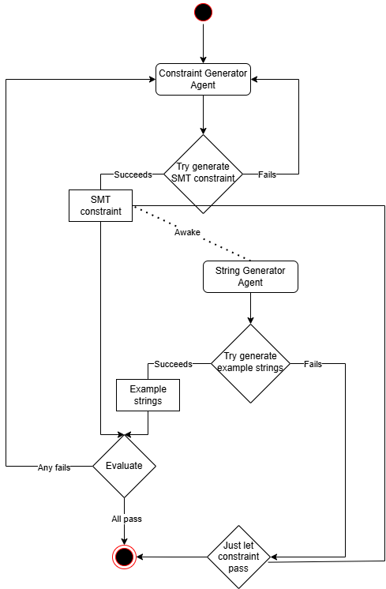
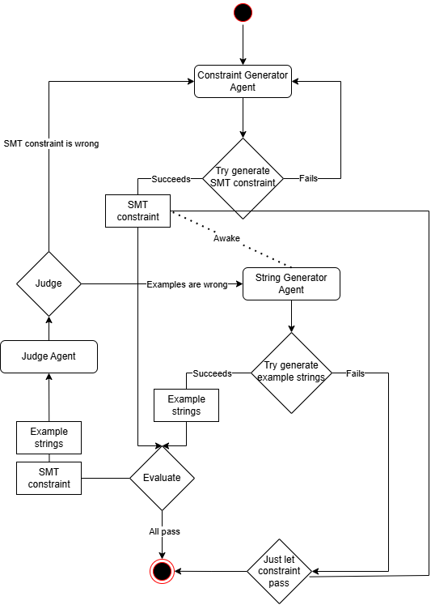

## Constraint Generator Demo (Week 3)

### How to run
1. Install the required packages from the project root.
2. Ensure you have defined a OPENAI_API_KEY in your environment variables. If not and if you don't want to set it, you can add the following line at the beginning of `constrain_generator/main.py`:
```python
import os

os.environ["OPENAI_API_KEY"] = "your_openai_api_key"
```
3. Run `llm_string/constraint_generator/demos/demo.py`

#### What's new
- `llm_string.constraint_generator` now exports `get_constraint_evaluator`, which is a convenient method to use the constraint evaluator in only a few lines.
  - Check out `llm_string/constraint_generator/demos/demo_short.py` for a minimal example.
- See section "String Generator and Judge".

### String Generator and Judge
The following illustrate the process to generate a SMT constraint since Week 1:


This flow uses `z3` to validate whether the constraint string is syntactically correct, but does not take into account the correctness of the constraint itself.

#### String Generator Agent

To check the correctness of the constraint, we implemented a string generator agent that simply generates 10 examples following the natural language constraint.

With the string generator agent capable of generating examples, we can use `get_constraint_evaluator` with `use_examples=True` to enable the following process:


Notice that, if the string generator agent fails (usually due to PydanticOutputParser unable to parse the output), we'll just let the constraint pass to not block the constraint from being delivered due to other agent's error.

#### Judge Agent
Since both agents are just LLMs, there is a chance that the string generator gives wrong strings and poisons the validation result. Which is why we also implemented a judge agent.

The judge agent's job is to make a "judgement" in case of an example test failure. It will decide which of the two agents (constraint generator and string generator) made a mistake and should correct itself.

We can use `get_constraint_evaluator` with `use_examples=True` and `use_judge=True` to enable the following process:


However, upon some experiments, the judge agent has a high rate of hallucination using the `gpt-4o-mini` model, while enabling `gpt-4o` greatly increase the rate of PydanticOutputParser failing to parse a value from the response. It's considered as unstable and discouraged to use in the current state.

#### Fault Tolerance
When using `get_constraint_evaluator` with `use_examples=True`, we can also set `fault_tolerant=True` to increase our chance of receiving a constraint validator.

With `fault_tolerant=True`, the evaluator will always remember the last syntactically correct constraint. If the process reached its maximum number of steps and still can't find a constraint that passes the correctness check, it will return the last syntactically correct constraint.


### Work in progress

To help you quickly understand what's done and what's not, here's a summary of the current status of the project:

| Feature                                               | Implemented  | Tested       |
|-------------------------------------------------------|--------------|--------------|
| NL to SMT-LIB2 constraint                             | ✅            | ✅            |
| NL to Z3Py constraint                                 | ✅            | ✅            |
| Constraint satisfiability validation                  | ✅            | ✅            |
| Multi-variable constraints                            | ✅            | ❌            |
| Feedback loop when generation failed                  | ✅            | ✅            |
| Logging                                               | ✅            | ✅            |
| Correctness check (a.k.a. string generator agent)     | ✅            | ✅            |
| Correctness judge                                     | ✅            | ❌            |
| Iterative genetic selection                           | Low priority | Low priority |
| LLM toolkit to teach LLM about constraint expressions | Low priority | Low priority |